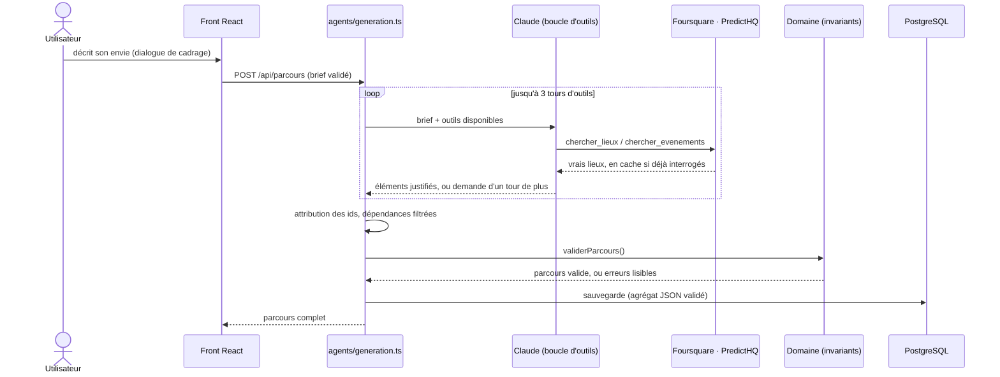
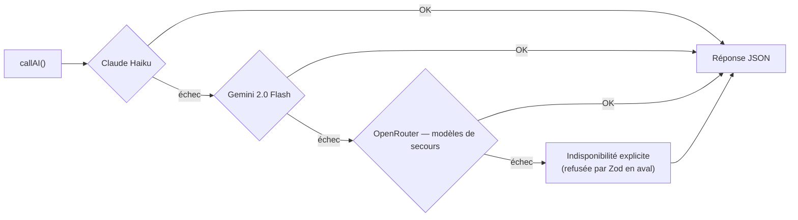

<div align="center">

# Experience AI

### Le moteur qui transforme une intention en parcours personnalisé

**Ne dis pas où tu veux aller. Dis ce que tu veux vivre.**

[](https://react.dev)
[](https://www.typescriptlang.org)
[](https://nodejs.org)
[](https://expressjs.com)
[](https://www.prisma.io)
[](https://www.postgresql.org)
[](https://vitest.dev)

[Documentation produit](docs/README.md) · [Modèle de domaine](docs/06-modele-conceptuel.md) · [Décisions (ADR)](docs/11-decisions.md) · [Suivi des sprints](docs/SPRINTS.md)

---

</div>

## Présentation

Les plateformes de voyage commencent toutes par la même question : *où veux-tu aller ?* Elles supposent que l'utilisateur connaît déjà sa destination — ce qui n'est vrai qu'une fois sur deux.

**Experience AI commence par une autre question : *qu'as-tu envie de vivre ?***

L'utilisateur décrit son envie en langage naturel → l'IA dialogue jusqu'à comprendre l'intention et le contexte → elle génère un **parcours cohérent** de moments justifiés, construit à partir de **vrais lieux** :

- Dialogue de cadrage qui ne pose que les questions manquantes, puis reformule pour validation
- Génération **outillée** : le modèle cherche de vrais lieux (Foursquare) et événements (PredictHQ) avant de répondre — il n'invente pas
- Chaque élément porte sa **justification** (pourquoi il sert l'intention) et, quand il vient d'un vrai lieu, son adresse
- **Modification chirurgicale** : remplacer un élément ne régénère pas le parcours, et ne recalcule que ses dépendances
- **Partage au groupe** par lien, avec visibilité privée / partagée / surprise (le héros d'un EVG ne voit rien de ce qu'on lui prépare)
- Le groupe **réagit** aux éléments (pour/contre) — l'organisateur tranche, l'avis éclaire sans décider
- **Mémoire simple** : les préférences enregistrées orientent les générations suivantes
- Cache mémoire des recherches externes ; chaque élément affiche son niveau
  **Vérifié / Estimé / Suggestion**, et l'absence des outils indispensables
  provoque une indisponibilité technique explicite

Un week-end romantique, un EVG, un festival, un séjour NBA, une soirée improvisée : **même moteur**, aucune notion de voyage câblée en dur.

---

## Ce qui distingue ce projet

> Experience AI **succède** à [TripGenie](https://github.com/loties1533/tripgenie-app), dont il réutilise l'ossature technique (auth, Express, Prisma, la cascade de fournisseurs LLM) — **mais pas le modèle.** TripGenie généra un `pack` de voyage figé (vols, hôtels, itinéraire à 3 jours) ; regénérer entièrement était le seul moyen de le modifier. Voir [ADR-0001](docs/decisions/ADR-0001.md).

Le projet a été conçu **produit d'abord, technique ensuite** : philosophie, définition du parcours, histoires utilisateur, modèle de domaine et capacités ont été verrouillés (`docs/00` → `docs/13`) avant la première ligne de code serveur — voir [`docs/README.md`](docs/README.md).

Le domaine porte des **invariants** qui doivent toujours être vrais ([doc 06](docs/06-modele-conceptuel.md)) :

1. Un parcours a toujours une intention et un contexte
2. Chaque élément porte une justification
3. La portée d'un recalcul = la portée de la dépendance
4. Une réservation n'est jamais un achat dans le produit — Experience AI organise, il ne réserve pas
5. Ni durée ni format fixes
6. L'utilisateur garde le dernier mot
7. Un arbitrage est définitif — une option écartée n'est jamais reproposée
8. Toute modification s'exerce dans le cadre du rôle de son auteur
9. Un élément vérifié porte sa provenance ; un lien officiel, de billetterie
   ou de carte ne peut pas habiller une simple suggestion

---

## Architecture

> **Le domaine est un module TypeScript pur, sans dépendance technique.** Il ne connaît ni la base, ni HTTP, ni le LLM — testable en quelques millisecondes, seule autorité sur ce qu'est un parcours valide. Les agents proposent, le domaine tranche.

```
server/
├── domaine/                    ← le cœur métier, zéro dépendance technique
│   ├── parcours/
│   │   ├── schema.ts           ← le modèle (Zod) : Parcours, Moment, Élément, Alternative…
│   │   ├── invariants.ts       ← dépendants, conflits d'horaires, responsabilités des rôles
│   │   └── modifications.ts    ← modification ciblée, pure et immuable
│   └── preferences.ts
├── agents/                     ← les usages du LLM, un rôle par fichier
│   ├── intake.ts               ← dialogue : n'extrait/ne pose que ce qui manque
│   ├── brief.ts                ← reformulation + normalisation (dates, etc.)
│   ├── generation.ts           ← brief → parcours complet, outillé (recherche de vrais lieux)
│   └── modification.ts         ← langage naturel → demande structurée
├── services/
│   ├── claude/
│   │   ├── core.ts             ← cascade de fournisseurs LLM + boucle d'outils
│   │   └── outils.ts           ← chercher_lieux · chercher_evenements · consulter_meteo
│   ├── foursquare.ts · predictHQ.ts · weather.ts · smartSearch.ts
├── depots/                     ← la seule frontière avec PostgreSQL
│   ├── depotParcours.ts        ← valide à chaque lecture, projette à chaque écriture
│   ├── depotPartage.ts         ← un jeton de partage par participant
│   └── depotPreferences.ts
└── routes/                     ← auth · parcours · partage (public) · photos
```

### Génération outillée : le modèle cherche avant de répondre



> **Contrat F1 validé.** Une génération outillée indisponible ne retombe plus sur un
> modèle sans sources : l'API renvoie une erreur technique `503`. Une recherche
> exécutée mais vide peut encore produire une idée générique, toujours marquée
> **Suggestion**, sans faux nom propre ni faux lien. Les éléments vérifiés
> conservent leur source, leur fournisseur et leur date de récupération. Un
> manque métier de données essentielles produit un refus `422`. Voir
> le [plan de fiabilité](docs/14-fiabilite-parcours.md) et
> [ADR-0008](docs/decisions/ADR-0008.md).

### Modification ciblée : le cœur du produit

*« Le paddle du samedi matin, remplace-le par quelque chose de moins physique »* ne régénère pas le parcours : le domaine cible l'élément, calcule ses dépendants (`elementsDependants`), et ne touche à rien d'autre. Vérifié en conditions réelles — sur un parcours de 11 éléments, 1 seul change, les 10 autres restent identiques au caractère près.

### Cascade LLM pour les tâches sans outils



La génération de parcours suit un contrat plus strict : sa boucle d'outils
Claude ne bascule pas vers `callAI()` si elle est indisponible. Tant que les
autres fournisseurs ne prennent pas eux-mêmes en charge les outils, elle
signale honnêtement l'indisponibilité au lieu de produire des lieux non vérifiés.

D'autres diagrammes (authentification, scalabilité) sont dans [`docs/architecture/`](docs/architecture/) — en Mermaid inline, rendus nativement par GitHub.

---

## Base de données

PostgreSQL via Prisma, requêtes typées de bout en bout. Le parcours se persiste comme un **agrégat** — une table, un contenu JSON validé à chaque lecture — plutôt qu'en 7-8 tables normalisées : voir [ADR-0007](docs/decisions/ADR-0007.md) pour le raisonnement.

```sql
users                  — comptes, auth JWT
parcours               — l'agrégat complet (intention, contexte, timeline, participants…)
                          + colonnes de projection pour lister/filtrer sans désérialiser
preferences_parcours   — mémoire simple, réutilisée à la génération
partages_parcours      — un jeton par participant, jamais par parcours (la surprise tient à ça)
```

> **Base isolée de TripGenie** : port `5434` / base `experience_ai` (TripGenie reste sur `5433` / `tripgenie`). Aucune donnée, aucun schéma partagé.

---

## Démarrage

```bash
# 1. Dépendances
npm install

# 2. Configuration
cp .env.example .env        # renseigner JWT_SECRET et au moins une clé LLM

# 3. Base de données
docker compose up -d db
npx prisma migrate deploy

# 4. Développement (API + front)
npm run dev:all
```

### Tests

```bash
npx vitest run
```

La suite couvre le domaine, les dépôts (Prisma mocké), les agents (LLM mocké —
aucun test n'appelle une vraie API), les routes, l'authentification, le partage
et la validation des entrées.

---

## API

| Méthode | Route | Rôle |
|---|---|---|
| `POST` | `/api/auth/signup` · `/api/auth/login` · `/api/auth/logout` | Authentification |
| `POST` | `/api/parcours/dialogue` | Dialogue de cadrage : reformule, ne demande que ce qui manque |
| `POST` | `/api/parcours` | Génère un parcours à partir du brief validé (outillé) |
| `GET` | `/api/parcours` | Liste les parcours de l'utilisateur |
| `GET` | `/api/parcours/:id` | Détail d'un parcours |
| `POST` | `/api/parcours/:id/modifications` | **Modification ciblée** d'un élément |
| `DELETE` | `/api/parcours/:id` | Supprime un parcours |
| `GET` `PUT` | `/api/parcours/preferences` | Mémoire simple |
| `GET` `PUT` | `/api/parcours/:id/partage` | Visibilité et liens de partage |
| `POST` `DELETE` | `/api/parcours/:id/participants` | Constituer le groupe (organisateur) |
| `GET` | `/api/partage/:jeton` | **Sans compte** : consulter le parcours partagé |
| `POST` | `/api/partage/:jeton/reactions` | **Sans compte** : réagir à un élément |

Les deux dernières routes sont les seules ouvertes du produit : un jeton permet de consulter et réagir, jamais de modifier — modifier exige un compte **et** le rôle qui l'autorise (invariant 8).

---

## Documentation

La documentation produit vit dans le dépôt et fait foi ([`docs/`](docs/README.md)) — **repo as code**, pas de Notion ni de Drive séparé qui divergerait ([ADR-0006](docs/decisions/ADR-0006.md)) :

- **[00 → 13](docs/README.md)** — de la philosophie au modèle conceptuel, aux histoires utilisateur et aux capacités
- **[ADR](docs/11-decisions.md)** — chaque décision structurante : contexte, alternatives, pourquoi, conséquences
- **[SPRINTS.md](docs/SPRINTS.md)** — le suivi de la refonte, sprint par sprint, chaque revue reliée à sa PR

Deux règles de gouvernance :
- **Le domaine n'évolue que sur preuve** — une preuve utilisateur (interview, test, usage réel) ou technique (le code révèle une impossibilité). Jamais sur une idée seule.
- **Une décision actée ne se rediscute pas ailleurs** — elle se lit dans son ADR.

---

## État du projet

Le modèle de domaine est **stable pour le MVP** : validé par crash-test contre six parcours très différents (passionné solo, couple avec surprise, soirée improvisée, famille, EVG, festival), puis par une recette manuelle de bout en bout qui a corrigé deux défauts réels (le brief qui perdait des informations, la génération qui échouait sur des dates de fin légitimes).

F0 et **F1 — vérité des données** sont validés : provenance
persistée, niveaux de confiance visibles, suggestions génériques, refus métier
et panne technique sont séparés. F2 — liens fiables pour les lieux et
événements — reste à faire. Voir le
[plan détaillé](docs/14-fiabilite-parcours.md) et les
[futurs sprints](docs/SPRINTS.md).

**Aucun vertical n'est retenu comme périmètre de validation.** Le scénario NBA
servira d'abord de test de robustesse et l'EVG de test de valeur, après la
fiabilisation. Le choix du premier marché reste une
[question ouverte](docs/questions-ouvertes.md).
