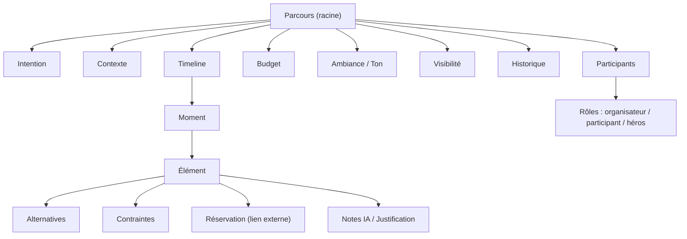

# 06 — Modèle de domaine

**Le cœur du logiciel. Zéro Prisma, zéro SQL, zéro React.**

> En DDD (Domain-Driven Design), on définit le **métier** avant toute technologie. Ce document décrit *ce qu'est* un parcours, indépendamment de la façon dont on le stockera. Il survit à tout changement de stack. La traduction technique (tables, API) viendra à l'étape 13 — et elle sera évidente.
> Le vocabulaire employé ici est figé dans le [Glossaire](12-glossaire.md).

## Vue d'ensemble

## L'agrégat racine : le Parcours
Le **Parcours** est l'objet central. Tout le reste lui appartient. Un parcours n'existe pas sans **Intention** et **Contexte** (invariant).

Il porte :
- **Intention** — le *pourquoi* (envie / passion / objectif). Point de départ, jamais une destination.
- **Contexte** — avec qui, durée, **dates**, lieu(x). Co-égal à l'intention.
  - *Durée et dates ne disent pas la même chose et ne se contredisent pas.* La **durée** est l'ordre de grandeur de l'envie : elle existe toujours, même sans calendrier (« une soirée », « trois semaines »). Les **dates** de début et de fin sont le calendrier réel : elles sont **optionnelles** (Karim qui sort ce soir n'en a pas ; une envie peut exister sans dates arrêtées), mais **quand elles existent, ce sont elles qui font foi**. On ne recalcule jamais l'une depuis l'autre, et un écart entre les deux n'est pas une erreur : c'est le signe qu'une envie de trois semaines s'est posée sur cinq jours de vacances.
  - *Cohérence garantie :* le début précède la fin, et **rien ne se passe en dehors** — toute plage horaire (d'un moment comme d'un élément) tombe dans les dates du parcours quand elles existent. Sans dates, aucune contrainte : le parcours flotte, et c'est légitime.
- **Participants** — de 1 à N, avec des **Rôles** (l'organisateur peut ≠ participant). Un participant **n'est pas forcément un utilisateur du produit** (Léa n'a pas de compte, elle existe pourtant dans le parcours).
- **Budget** — **individuel ou partagé**. Sert de contrainte pilotante.
- **Ambiance / Ton** — propriété transverse qui teinte tous les éléments.
- **Visibilité** — privé / partagé / surprise (certains participants ne voient pas).
- **Historique** — le journal des modifications (permet d'annuler), **y compris les arbitrages** de l'utilisateur (option écartée = mémorisée). *Un arbitrage reste un événement de l'Historique, pas un objet métier — question laissée ouverte tant que plusieurs journeys ne réclament pas plus (voir Questions ouvertes).* L'option écartée en garde simplement la trace (voir Alternative) : l'Historique raconte **quand** on a tranché, l'Alternative sait **qu'on a tranché**.
- **Timeline** — la suite ordonnée de **Moments**.

## Les entités

### Moment
Une tranche du parcours (matin, soir… ou une plage d'heures). **Granularité élastique** : de quelques heures (soirée) à une journée (voyage). Un Moment contient un ou plusieurs **Éléments**, y compris des **temps libres** assumés.

### Élément
La matière concrète d'un moment. Il a un **type** (activité, resto, transport, hébergement, événement, temps libre), un **contenu** (nom, lieu, horaire, prix), une **justification**, un **niveau de confiance**, un **statut** (proposé / accepté / à remplacer) et des **dépendances** (ce resto dépend du lieu du soir…).
- Un Élément peut être une **Ancre** : un événement daté (festival, match) autour duquel le reste du parcours s'organise.
- Un Élément peut porter des **Alternatives**, des **Contraintes**, une **Réservation**.

## Les objets-valeur (Value Objects)
- **Contrainte** — trois natures :
  - *dure / datée* (un match, un set → horaire non négociable ; peut créer des **conflits** à arbitrer) ;
  - *filtre* (adapté aux enfants, mobilité → exclut des éléments) ;
  - *souple* (ambiance, niveau, rythme → oriente sans exclure).
- **Alternative** — une option de remplacement d'un élément (plan B). Elle est soit **proposable**, soit **écartée** : écartée, elle reste dans le parcours (on n'efface pas une décision) mais n'est plus jamais offerte. *Forme retenue : un simple drapeau sur l'option, pas un objet « Arbitrage » — l'invariant 7 demande de ne plus reproposer, pas de modéliser la délibération.*
- **Confiance** — qualifie l'identité de l'élément :
  - *vérifié* : source, fournisseur et date de récupération obligatoires ;
  - *estimé* : valeur plausible mais non confirmée en temps réel ;
  - *suggestion* : idée générique, sans prétention d'existence.
  Le prix est qualifié séparément par `prixEstime`.
- **Réservation** — un **lien externe** typé (officiel, billetterie, recherche
  ou carte) vers un service tiers. Un lien autre qu'une recherche exige un
  élément vérifié. **Jamais un achat dans le produit** (Constitution #5).
- **Rôle** — la fonction d'un participant, définie par ses **responsabilités métier** (pas des « permissions » techniques — la technique les déduira plus tard) :
  - *organisateur* — responsable du parcours : décide, modifie, supprime ;
  - *participant* — contribue : propose, vote, ajuste ce qui lui est délégué ;
  - *héros* — celui pour qui le parcours existe ; peut être exclu de la visibilité (surprise) ; ne décide pas.

  Quatre responsabilités suffisent à dire qui peut quoi (invariant 8) :

  | Responsabilité | Ce que c'est | organisateur | participant | héros |
  |---|---|---|---|---|
  | *proposer* | ajouter un élément | oui | oui | non |
  | *ajuster* | remplacer un élément, changer son statut | oui | oui | non |
  | *supprimer* | retirer un élément du parcours | oui | non | non |
  | *arbitrer* | écarter définitivement une option | oui | non | non |

  Un **arbitrage** engage tout le parcours et ne se défait pas : il relève de celui qui décide, pas de celui qui contribue. Et **qui n'est pas participant du parcours n'a aucune main dessus**.
- **Justification (Note IA)** — le *pourquoi* d'un élément (cohérence et confiance).

## Les invariants (toujours vrais)
1. Un Parcours a **toujours** une Intention et un Contexte.
2. Chaque Élément porte une **justification**.
3. **La portée d'un recalcul = la portée de la dépendance.** Modifier un Élément ne recalcule que ses dépendances directes ; modifier une donnée globale (budget, durée, participants) recalcule ce qui en dépend — potentiellement tout, et c'est cohérent.
4. Une Réservation **n'est jamais un achat** in-app.
5. Un Parcours n'a **ni durée ni format fixes** (soirée, EVG, festival, séjour = même modèle).
6. L'utilisateur garde le dernier mot : tout élément est acceptable / refusable / remplaçable.
7. **Un arbitrage est définitif** : une option écartée par l'utilisateur n'est jamais reproposée (sauf demande explicite).
   *Précision née du code :* le produit ne propose **que** les alternatives non écartées — c'est la seule liste que voient le front et l'IA de modification. Un arbitrage survit même au remplacement de l'élément qui le portait. La « demande explicite » reste possible : l'utilisateur peut toujours redemander lui-même ce qu'il avait écarté, ce qui lui est interdit, c'est de se le voir **reproposer**.
8. Toute modification s'exerce dans le cadre des **responsabilités du rôle** de son auteur.
   *Précision née du code :* toute modification est signée par un participant ; son rôle doit couvrir la responsabilité engagée (tableau ci-dessus), sinon elle est refusée avec une explication — jamais appliquée à moitié.
9. Un élément présenté comme **vérifié** porte sa provenance complète ; un lien
   officiel, de billetterie ou de carte ne peut pas être rattaché à une simple
   suggestion. Une ancre datée doit être vérifiée.

## Règle de primauté des invariants
Quand une histoire casse un invariant, la première question n'est plus « comment changer le domaine ? » mais : **le journey est-il légitime, ou l'invariant protège-t-il quelque chose de plus important ?** Les invariants sont la Constitution du domaine ; ce sont parfois les histoires qui doivent s'adapter. (Sinon, les fondations bougent sans arrêt.)

## Statut du modèle & critère de sortie
Le domaine est déclaré **stable** (pas parfait) lorsque :
- les 6 journeys passent sans contradiction majeure ;
- aucun nouvel agrégat ou concept métier n'apparaît ;
- les corrections restantes sont des raffinements (nommage, formulation, précision) ;
- deux passes complètes de crash-test n'ont révélé aucune nouvelle fissure critique.

**À partir de ce moment : on n'améliore plus le domaine, on commence l'architecture.**

Journal des passes :
- **Passe 1** (2026-07-23) — 3 fissures critiques : responsabilités absentes des rôles, arbitrage sans lieu de mémoire, invariant 3 contradictoire. → Corrigées (invariants 3, 7, 8 + Rôle enrichi).
- **Passe 2** (2026-07-23, post-corrections, 6 journeys) — aucune fissure critique ; 1 raffinement (participant ≠ utilisateur du produit). → Intégré.
- **Passe 3** (2026-07-23, confirmation sur les 8 invariants) — rien de nouveau. → **DOMAINE DÉCLARÉ STABLE POUR LE MVP.**

> « Stable » ne veut pas dire figé : un domaine n'est jamais terminé (accessibilité, événements récurrents, pro… viendront peut-être). Ça veut dire : **suffisamment solide pour construire.**

## Règle d'évolution du domaine (à partir de maintenant)
Toute modification du domaine doit être justifiée **par du code ou par un utilisateur réel** — plus par une discussion théorique.
- ❌ « J'ai pensé à un nouveau cas. »
- ✅ « En implémentant cette fonctionnalité, le modèle ne permet pas… »
- ✅ « Trois utilisateurs ont rencontré ce problème. »

## Traçabilité vers les histoires (ce que le modèle rend possible)
- « change juste le resto du jour 3 » → adressage Élément + dépendances *(Thomas, Karim)*.
- Surprise où l'un organise pour l'autre → Participants + Rôles + Visibilité *(Sam & Léa)*.
- Budget qui se réajuste pour un groupe → Budget partagé *(EVG)*.
- Festival au centre → Élément **Ancre** + Contraintes datées en conflit *(Inès)*.
- Vacances au bon rythme → Contraintes *filtres* + densité des Moments *(Famille)*.
- Des matchs et des sets à une date précise → **dates** du parcours + plages des éléments *(Thomas, Inès)*.

## Ce que ce modèle n'est PAS
Ni Prisma, ni tables, ni endpoints. La traduction technique se fera à l'étape 13 (Architecture) et **découlera directement** de ce modèle.
