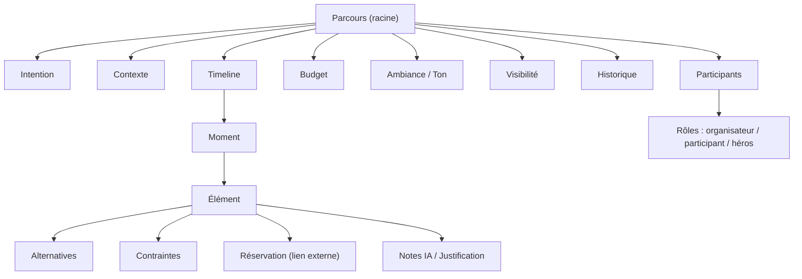

# 06 — Modèle de domaine

**Le cœur du logiciel. Zéro Prisma, zéro SQL, zéro React.**

> En DDD (Domain-Driven Design), on définit le **métier** avant toute technologie. Ce document décrit *ce qu'est* un parcours, indépendamment de la façon dont on le stockera. Il survit à tout changement de stack. La traduction technique (tables, API) viendra à l'étape 13 — et elle sera évidente.
> Le vocabulaire employé ici est figé dans le [Glossaire](12-glossaire.md).

## Vue d'ensemble

## L'agrégat racine : le Parcours
Le **Parcours** est l'objet central. Tout le reste lui appartient. Un parcours n'existe pas sans **Intention** et **Contexte** (invariant).

Il porte :
- **Intention** — le *pourquoi* (envie / passion / objectif). Point de départ, jamais une destination.
- **Contexte** — avec qui, durée, lieu(x). Co-égal à l'intention.
- **Participants** — de 1 à N, avec des **Rôles** (l'organisateur peut ≠ participant).
- **Budget** — **individuel ou partagé**. Sert de contrainte pilotante.
- **Ambiance / Ton** — propriété transverse qui teinte tous les éléments.
- **Visibilité** — privé / partagé / surprise (certains participants ne voient pas).
- **Historique** — le journal des modifications (permet d'annuler).
- **Timeline** — la suite ordonnée de **Moments**.

## Les entités

### Moment
Une tranche du parcours (matin, soir… ou une plage d'heures). **Granularité élastique** : de quelques heures (soirée) à une journée (voyage). Un Moment contient un ou plusieurs **Éléments**, y compris des **temps libres** assumés.

### Élément
La matière concrète d'un moment. Il a un **type** (activité, resto, transport, hébergement, événement, temps libre), un **contenu** (nom, lieu, horaire, prix), une **justification**, un **statut** (proposé / accepté / à remplacer) et des **dépendances** (ce resto dépend du lieu du soir…).
- Un Élément peut être une **Ancre** : un événement daté (festival, match) autour duquel le reste du parcours s'organise.
- Un Élément peut porter des **Alternatives**, des **Contraintes**, une **Réservation**.

## Les objets-valeur (Value Objects)
- **Contrainte** — trois natures :
  - *dure / datée* (un match, un set → horaire non négociable ; peut créer des **conflits** à arbitrer) ;
  - *filtre* (adapté aux enfants, mobilité → exclut des éléments) ;
  - *souple* (ambiance, niveau, rythme → oriente sans exclure).
- **Alternative** — une option de remplacement d'un élément (plan B).
- **Réservation** — un **lien externe** vers un service tiers. **Jamais un achat dans le produit** (Constitution #5).
- **Rôle** — la fonction d'un participant : organisateur / participant / héros.
- **Justification (Note IA)** — le *pourquoi* d'un élément (cohérence et confiance).

## Les invariants (toujours vrais)
1. Un Parcours a **toujours** une Intention et un Contexte.
2. Chaque Élément porte une **justification**.
3. Modifier un Élément **ne recalcule que ses dépendances** — jamais tout le parcours.
4. Une Réservation **n'est jamais un achat** in-app.
5. Un Parcours n'a **ni durée ni format fixes** (soirée, EVG, festival, séjour = même modèle).
6. L'utilisateur garde le dernier mot : tout élément est acceptable / refusable / remplaçable.

## Traçabilité vers les histoires (ce que le modèle rend possible)
- « change juste le resto du jour 3 » → adressage Élément + dépendances *(Thomas, Karim)*.
- Surprise où l'un organise pour l'autre → Participants + Rôles + Visibilité *(Sam & Léa)*.
- Budget qui se réajuste pour un groupe → Budget partagé *(EVG)*.
- Festival au centre → Élément **Ancre** + Contraintes datées en conflit *(Inès)*.
- Vacances au bon rythme → Contraintes *filtres* + densité des Moments *(Famille)*.

## Ce que ce modèle n'est PAS
Ni Prisma, ni tables, ni endpoints. La traduction technique se fera à l'étape 13 (Architecture) et **découlera directement** de ce modèle.
