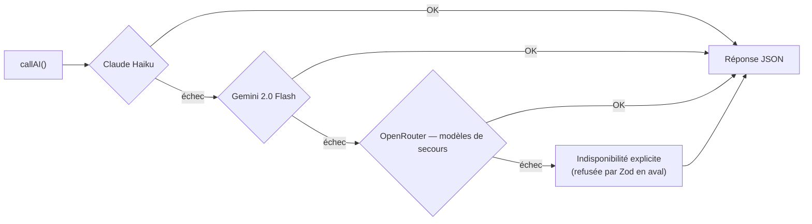
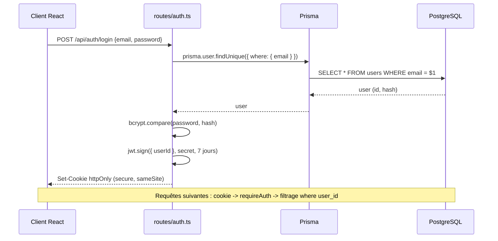
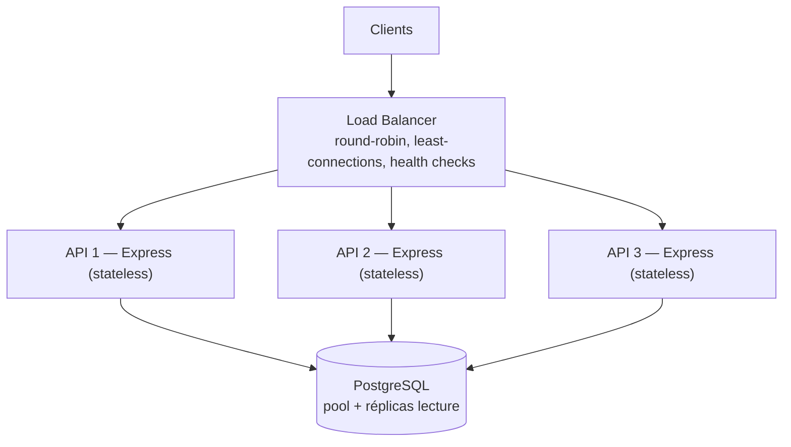

# Architecture technique — Experience AI

> **Instantané partiel, en phase de build.** L'architecture de référence vit là où elle reste à jour : l'arbo `server/` du [README principal](../../README.md) et le modèle de domaine du [doc 06](../06-modele-conceptuel.md) (lui-même un diagramme Mermaid courant).
>
> Ce dossier ne garde que les schémas **transverses et stables** — ceux qui ne bougent pas à chaque sprint. Les diagrammes de schéma (ERD/MCD), de pipeline de génération et de scoring, hérités de TripGenie, ont été retirés : ils décrivaient un système (`trips`/`packs`, scoring déterministe) qui n'existe plus. On en refera de justes quand le modèle sera stable et déployé.
>
> Les diagrammes sont écrits en **Mermaid**, directement dans ce fichier : GitHub les rend nativement, sans image à regénérer ni risque de version périmée.

---

## Cascade LLM (repli automatique)

`callAI()` essaie les fournisseurs dans l'ordre ; le premier qui répond gagne. Aucun contenu inventé en dernier recours : si tout échoue, l'indisponibilité est **explicite** et refusée par la validation Zod en aval.

> La génération de parcours utilise une variante **outillée** de cet appel (`callAIAvecOutils`) : le modèle peut chercher de vrais lieux (Foursquare) et événements (PredictHQ) avant de répondre. Même cascade de fournisseurs.

---

## Authentification JWT

Le JWT transite dans un **cookie httpOnly** (jamais accessible au JS du navigateur). Chaque route protégée filtre sur l'utilisateur du token.

---

## Scalabilité horizontale

Les instances Express sont **stateless** (l'état est porté par le JWT), donc réplicables derrière un load balancer.

