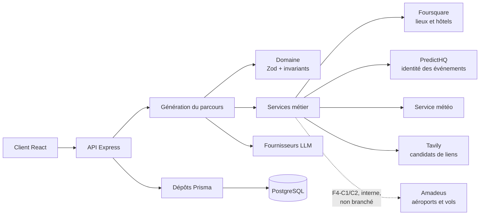
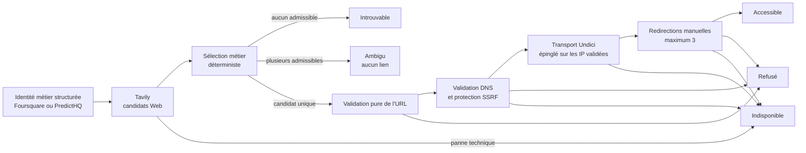
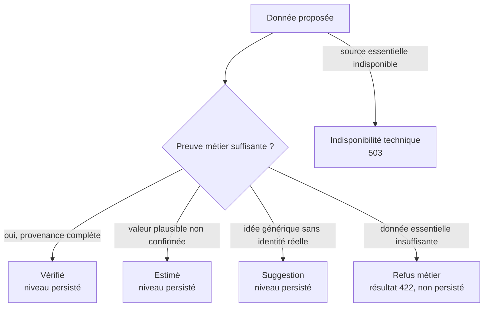
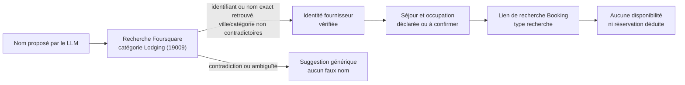
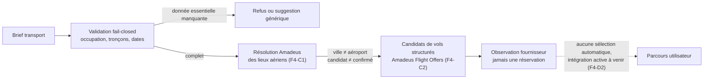
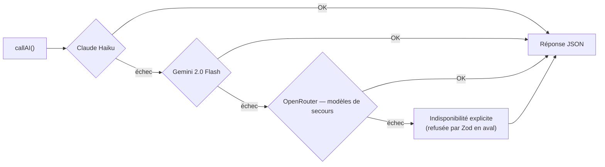
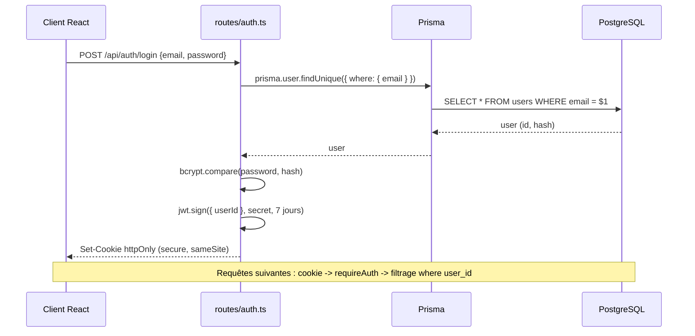
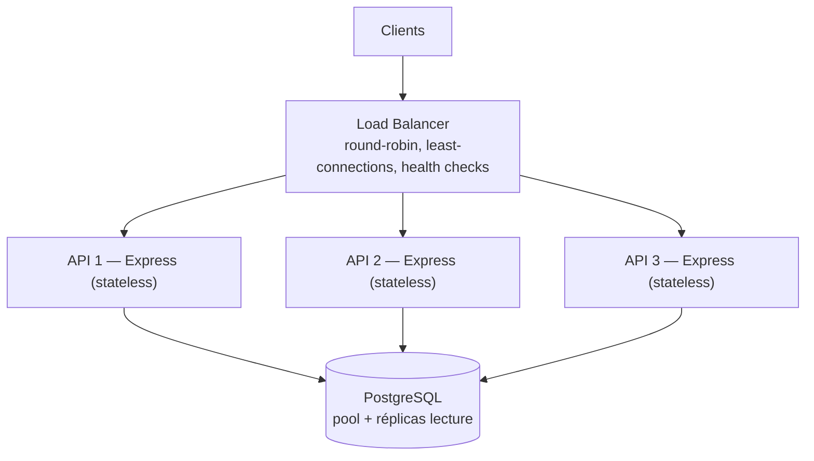

# Architecture technique — Experience AI

> **Instantané de l'architecture actuelle.** L'arborescence de référence reste
> celle du [README principal](../../README.md) et le modèle métier celui du
> [doc 06](../06-modele-conceptuel.md).
>
> Les anciens diagrammes `trips`/`packs` et scoring de TripGenie ont été
> retirés : ils ne décrivent pas Experience AI.
>
> Les diagrammes sont écrits en **Mermaid**, directement dans ce fichier :
> GitHub les rend nativement, sans image à régénérer.

---

## Architecture globale

Foursquare, PredictHQ et Tavily alimentent la génération active (F2-A, F2-B5,
F3-B). Amadeus (F4-C1, F4-C2) est implémenté et testé mais reste **interne** :
aucun fichier hors `server/services/amadeus/` ne l'importe — il n'est appelé
ni par la génération, ni par les routes publiques, ni par l'OpenAPI, ni par le
front, ni par la persistance.

---

## Pipeline de résolution des liens

Tavily ne décide jamais seul et aucun LLM ne classe un lien comme réel. Le rang
de recherche ne départage pas plusieurs candidats. Une réservation ou une
billetterie exige des preuves explicites ; une page accessible ne devient pas
pour autant un site officiel. Faute de preuve externe forte, F2-B ne produit
actuellement aucun lien `officiel`. Une redirection vers un autre domaine
enregistrable invalide la preuve métier.

Le contrôle réseau commence seulement après la sélection d'un candidat unique.
Il distingue `accessible`, `refuse` et `indisponible` : une panne réseau n'est
jamais transformée en résultat `introuvable`.

**F2-B5 est actif.** `resoudreLien` (au singulier) est appelé depuis
`agents/generation.ts` pour chaque demande de lien rattachée à une identité
métier — ce pipeline complet (sélection puis contrôle réseau) tourne
aujourd'hui dans la génération réelle des parcours. L'ancienne fonction
`resoudreLiensReels` (résolution groupée par ville, antérieure à F2-B) reste
présente dans le code et sa suite de tests, mais **n'est plus appelée par le
flux actif**.

#### Deux failles corrigées en revue contradictoire (F2-B4)

La première implémentation de F2-B4 passait ses tests initiaux, mais une
revue ciblée a trouvé deux défauts avant fusion :

1. **Fenêtre SSRF par DNS rebinding.** Les adresses DNS étaient contrôlées,
   mais la requête HTTP réelle pouvait effectuer sa propre résolution au
   moment de la connexion — un domaine malveillant pouvait répondre avec une
   IP publique pendant le contrôle puis une IP privée au moment de la
   requête. Corrigé par un transport **Undici épinglé** : un `Agent` dont le
   `connect.lookup` est remplacé pour n'utiliser que les adresses déjà
   validées, sans jamais retomber sur le DNS système.
2. **Transfert injustifié de preuve métier après redirection.** Une URL
   classée `reservation` ou `billetterie` pouvait rediriger vers un autre
   domaine public tout en conservant son type et ses preuves initiales.
   Corrigé par comparaison du domaine enregistrable initial et final (via
   `tldts`) : une preuve métier n'est conservée qu'entre sous-domaines du
   même domaine enregistrable ; tout changement de domaine enregistrable
   invalide la preuve (`changement_domaine_enregistrable`).

---

## Niveaux de confiance

**Refus** est un résultat métier de génération, pas un quatrième niveau
persisté. Une URL techniquement accessible ne suffit jamais à produire
**Vérifié** ni à prouver qu'un domaine est officiel.

> La politique de confiance est décidée une seule fois, dans
> [ADR-0008](../decisions/ADR-0008.md) — source unique. Ce diagramme en est
> une illustration ; il ne redéfinit rien.

---

## Résolution des hébergements (F3)

Un nom d'hôtel produit par le LLM n'est jamais une identité (ADR-0008). Le
lien Booking construit en F3-C2 est un lien de **recherche** : il ne prouve ni
prix, ni disponibilité, ni réservation — Booking reste seul responsable de ses
résultats. Les modifications hôtelières sont verrouillées (F3-D) par un
contrat client strict qui empêche de forger confiance, provenance ou identité.

---

## Résolution du transport (F4)

**Amadeus (F4-C1, F4-C2) est interne** : implémenté et testé, mais non appelé
par la génération active, les routes publiques, l'OpenAPI, le front ou la
persistance. Une ville n'est jamais automatiquement un aéroport, un candidat
fournisseur n'est jamais automatiquement un lieu confirmé, et une heure locale
sans fuseau fiable n'est jamais promue en instant absolu (aucun `Z`, offset ou
fuseau IANA inventé). Aucun prix, billet, réservation ou disponibilité
garantie n'est produit à ce stade. Prochain sous-lot : F4-C3 (trains et
transports locaux), puis F4-D (liens et intégration) et F4-E (API et front).

> **Principe transverse.** Un service déterministe ne devient pas un agent
> LLM sans besoin réel de raisonnement — construire une URL, résoudre un
> aéroport, comparer des dates ou calculer une somme restent des fonctions
> déterministes, pour les lieux comme pour les hôtels et le transport.

---

## Cascade LLM (repli automatique)

`callAI()` essaie les fournisseurs dans l'ordre pour les tâches sans outils ; le
premier qui répond gagne. Aucun contenu inventé en dernier recours : si tout
échoue, l'indisponibilité est **explicite** et refusée par la validation Zod en
aval.

> La génération de parcours utilise une variante **outillée**
> (`callAIAvecOutils`) pour chercher de vrais lieux et événements. Elle ne
> bascule pas silencieusement vers la cascade sans outils : si son fournisseur
> outillé est indisponible, elle renvoie une indisponibilité explicite.

---

## Authentification JWT

Le JWT transite dans un **cookie httpOnly** (jamais accessible au JS du navigateur). Chaque route protégée filtre sur l'utilisateur du token.

---

## Scalabilité horizontale

Les instances Express sont **stateless** (l'état est porté par le JWT), donc réplicables derrière un load balancer.

