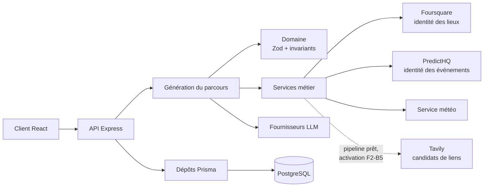
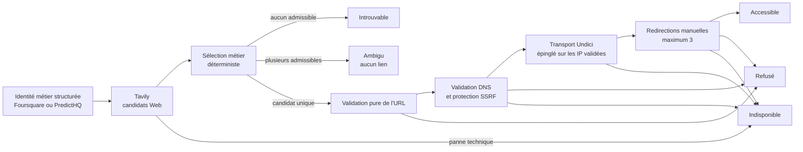
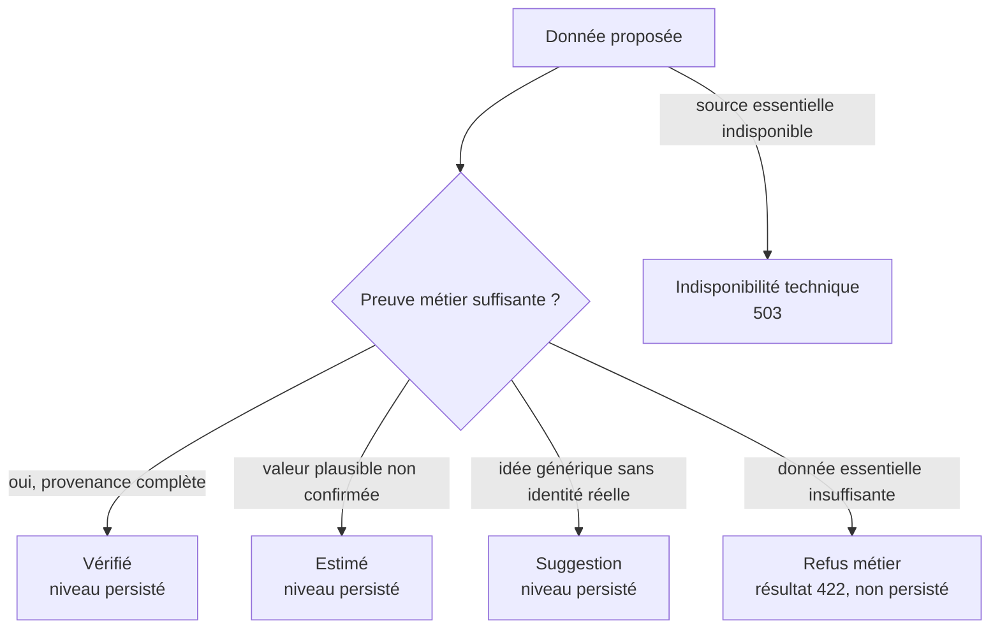
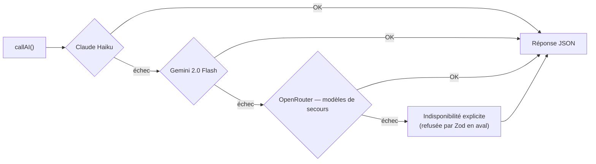
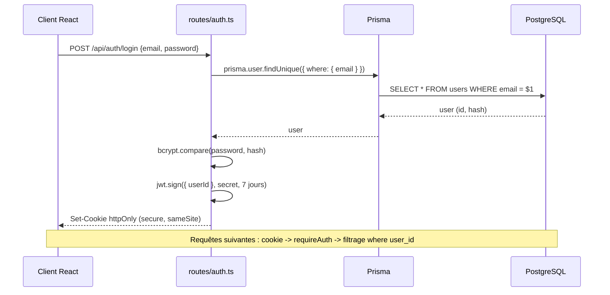
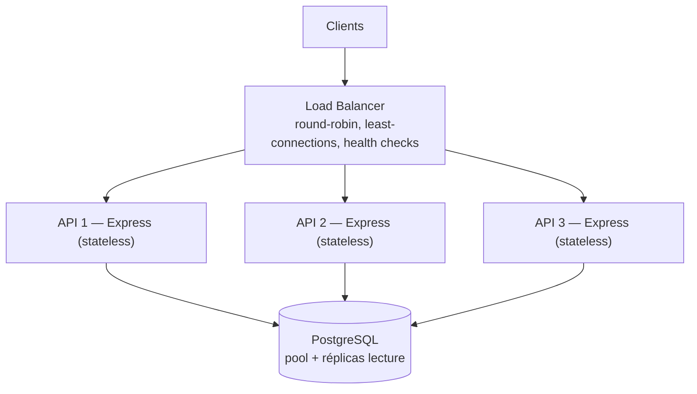

# Architecture technique — Experience AI

> **Instantané de l'architecture actuelle.** L'arborescence de référence reste
> celle du [README principal](../../README.md) et le modèle métier celui du
> [doc 06](../06-modele-conceptuel.md).
>
> Les anciens diagrammes `trips`/`packs` et scoring de TripGenie ont été
> retirés : ils ne décrivent pas Experience AI.
>
> Les diagrammes sont écrits en **Mermaid**, directement dans ce fichier :
> GitHub les rend nativement, sans image à régénérer.

---

## Architecture globale

Foursquare et PredictHQ alimentent déjà la génération outillée. Tavily est
utilisé par le résolveur sécurisé livré jusqu'à F2-B4, mais ce résolveur n'est
pas encore activé dans les parcours : cette jonction appartient à F2-B5.

---

## Pipeline de résolution des liens

Tavily ne décide jamais seul et aucun LLM ne classe un lien comme réel. Le rang
de recherche ne départage pas plusieurs candidats. Une réservation ou une
billetterie exige des preuves explicites ; une page accessible ne devient pas
pour autant un site officiel. Faute de preuve externe forte, F2-B ne produit
actuellement aucun lien `officiel`. Une redirection vers un autre domaine
enregistrable invalide la preuve métier.

Le contrôle réseau commence seulement après la sélection d'un candidat unique.
Il distingue `accessible`, `refuse` et `indisponible` : une panne réseau n'est
jamais transformée en résultat `introuvable`.

`resoudreLiensReels` reste neutralisé jusqu'à F2-B5. L'appel depuis la
génération, la persistance, l'OpenAPI, les contrats de sortie et l'affichage
client sont donc hors périmètre actuel.

---

## Niveaux de confiance

**Refus** est un résultat métier de génération, pas un quatrième niveau
persisté. Une URL techniquement accessible ne suffit jamais à produire
**Vérifié** ni à prouver qu'un domaine est officiel.

---

## Cascade LLM (repli automatique)

`callAI()` essaie les fournisseurs dans l'ordre pour les tâches sans outils ; le
premier qui répond gagne. Aucun contenu inventé en dernier recours : si tout
échoue, l'indisponibilité est **explicite** et refusée par la validation Zod en
aval.

> La génération de parcours utilise une variante **outillée**
> (`callAIAvecOutils`) pour chercher de vrais lieux et événements. Elle ne
> bascule pas silencieusement vers la cascade sans outils : si son fournisseur
> outillé est indisponible, elle renvoie une indisponibilité explicite.

---

## Authentification JWT

Le JWT transite dans un **cookie httpOnly** (jamais accessible au JS du navigateur). Chaque route protégée filtre sur l'utilisateur du token.

---

## Scalabilité horizontale

Les instances Express sont **stateless** (l'état est porté par le JWT), donc réplicables derrière un load balancer.

